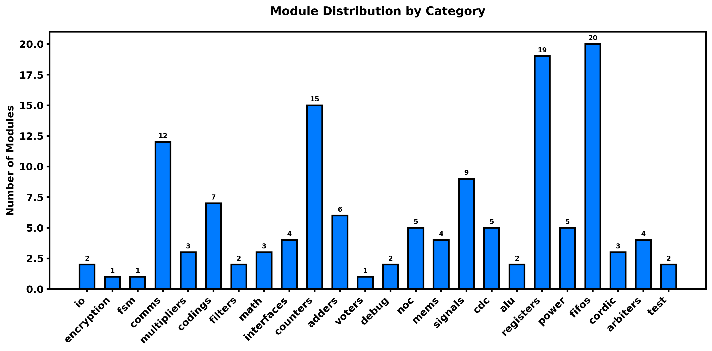
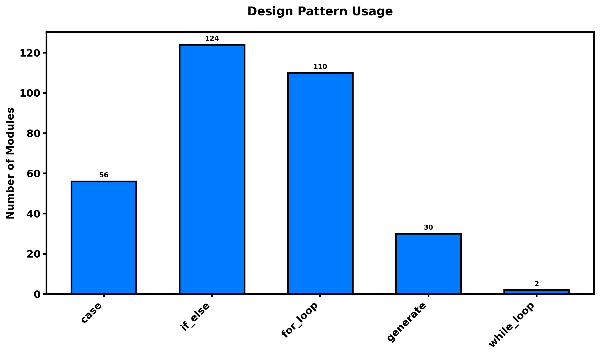
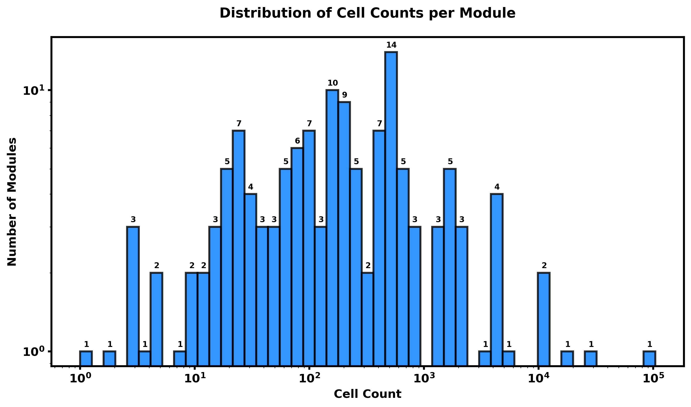
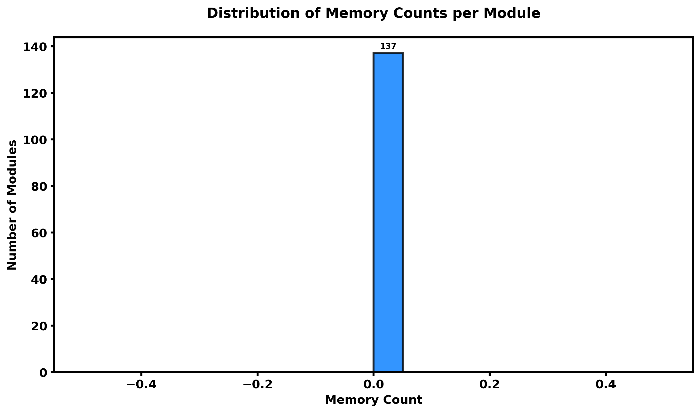

# Verilog Dataset Analysis Report

## Dataset Overview

The dataset contains 138 Verilog modules across 24 different categories, providing a comprehensive collection of digital design components.

### Module Distribution by Category

### Synchronous vs Asynchronous Designs

- Synchronous Designs: 116
- Asynchronous Designs: 22

## Code Metrics

### Average Metrics per Module
- Lines of Code: 116.20
- Parameters: 2.75
- Ports: 11.21

### Module Complexity Distribution

- Simple (0-50 lines): 38
- Medium (51-200 lines): 81
- Complex (>200 lines): 19

## Design Patterns

| Pattern | Count | Percentage |
|---------|-------|------------|
| generate | 30 | 21.7% |
| for_loop | 111 | 80.4% |
| case | 57 | 41.3% |
| if_else | 125 | 90.6% |
| while_loop | 2 | 1.4% |

## Category Details

- fifos: 20 modules
- registers: 19 modules
- counters: 15 modules
- comms: 12 modules
- signals: 9 modules
- codings: 7 modules
- adders: 6 modules
- cdc: 5 modules
- noc: 5 modules
- power: 5 modules
- arbiters: 4 modules
- interfaces: 4 modules
- mems: 4 modules
- cordic: 3 modules
- math: 3 modules
- multipliers: 3 modules
- alu: 2 modules
- debug: 2 modules
- encryption: 2 modules
- filters: 2 modules
- io: 2 modules
- test: 2 modules
- fsm: 1 modules
- voters: 1 modules

## Synthesis Statistics (Yosys)

The following table summarizes the gate (cell) count, wire count, memory countfor each module as reported by Yosys synthesis:

| Module | Gate/Cell Count | Wire Count | Memory Count |
|--------|-----------------|------------|--------------|
| configurable_brent_kung_adder | 160 | 133 | 0 |
| configurable_carry_lookahead_adder | 104 | 129 | 0 |
| configurable_carry_select_adder | 88 | 1362 | 0 |
| configurable_carry_skip_adder | 226 | 231 | 0 |
| configurable_conditional_sum_adder | 68 | 541 | 0 |
| configurable_kogge_stone_adder | 549 | 522 | 0 |
| alu | 353 | 344 | 0 |
| configurable_comparator | 109 | 115 | 0 |
| arbiter | 19 | 16 | 0 |
| arbiter_rr | 82 | 78 | 0 |
| fair_priority_arbiter | 147 | 148 | 0 |
| matrix_arbiter | 175 | 203 | 0 |
| bsg_async_credit_counter | 15 | 38 | 0 |
| clock_domain_crossing | 79 | 23 | 0 |
| clock_domain_crossing_fifo | 1758 | 1171 | 0 |
| handshake_synchronizer | 78 | 25 | 0 |
| multi_flop_synchronizer | 2 | 6 | 0 |
| binary_to_gray | 3 | 2 | 0 |
| configurable_priority_encoder | 27 | 27 | 0 |
| gray_to_binary | 3 | 3 | 0 |
| hamming_code | 57 | 55 | 0 |
| parameterized_crc_generator | 50 | 40 | 0 |
| parameterized_scrambler | 13 | 12 | 0 |
| priority_encoder | 27 | 27 | 0 |
| ahb_lite_master | 518 | 378 | 0 |
| basic_spi_master | 156 | 127 | 0 |
| final_spi_master | 162 | 126 | 0 |
| fixed_spi_master | 157 | 128 | 0 |
| parameterized_deserializer | 87 | 72 | 0 |
| parameterized_i2c_master | 413 | 382 | 0 |
| parameterized_serdes | 107 | 89 | 0 |
| parameterized_spi_master | 180 | 147 | 0 |
| parameterized_uart_rx | 598 | 518 | 0 |
| parameterized_uart_tx | 109 | 89 | 0 |
| simple_spi_master | 166 | 137 | 0 |
| spi_master | 161 | 125 | 0 |
| cordic | 846 | 709 | 0 |
| cordic_core | 4045 | 4044 | 0 |
| sine_cosine_generator | 277 | 241 | 0 |
| configurable_clz_clo | 490 | 487 | 0 |
| gray_counter | 36 | 33 | 0 |
| johnson_counter | 9 | 11 | 0 |
| leading_zero_counter | 165 | 161 | 0 |
| loadable_updown_counter | 77 | 76 | 0 |
| parameterized_decade_counter | 18 | 15 | 0 |
| parameterized_gray_counter | 12 | 10 | 0 |
| parameterized_johnson_counter | 5 | 6 | 0 |
| parameterized_johnson_updown_counter | 10 | 12 | 0 |
| parameterized_loadable_counter | 33 | 25 | 0 |
| parameterized_onehot_counter | 15 | 12 | 0 |
| parameterized_ring_counter | 4 | 5 | 0 |
| parameterized_self_correcting_counter | 23 | 22 | 0 |
| parameterized_sync_reset_counter | 36 | 33 | 0 |
| parameterized_updown_counter | 35 | 38 | 0 |
| logic_analyzer | 104318 | 72474 | 0 |
| performance_counter | 1504 | 964 | 0 |
| aes_core | N/A | N/A | N/A |
| true_random_generator | 424 | 265 | 0 |
| async_fifo | 504 | 334 | 0 |
| barrel_shifter_fifo | 4367 | 4249 | 0 |
| bidirectional_fifo | 747 | 469 | 0 |
| cache_fifo | 10770 | 0 | 0 |
| circular_buffer_fifo | 644 | 500 | 0 |
| configurable_param_fifo | 400 | 262 | 0 |
| configurable_sync_fifo | 525 | 0 | 0 |
| credit_based_fifo | 555 | 410 | 0 |
| dual_clock_fifo | 466 | 316 | 0 |
| elastic_buffer | 270 | 186 | 0 |
| fifo | 488 | 353 | 0 |
| fwft_fifo | 388 | 245 | 0 |
| memory_mapped_fifo | 1945 | 1322 | 0 |
| multi_ported_fifo | 1394 | 798 | 0 |
| parameterized_priority_queue | 1826 | 1523 | 0 |
| pipelined_fifo | 144 | 126 | 0 |
| showahead_fifo | 499 | 368 | 0 |
| skid_buffer | 46 | 32 | 0 |
| smart_fifo | 1268 | 670 | 0 |
| sync_fifo | 380 | 236 | 0 |
| configurable_fir_filter | 1403 | 0 | 0 |
| fir_filter | 296 | 239 | 0 |
| sequence_detector_fsm | 61 | 54 | 0 |
| axi_lite_master | 204 | 88 | 0 |
| axi_stream_interface | 0 | 20 | 0 |
| pcie_endpoint | 405 | 380 | 0 |
| wishbone_master | 229 | 141 | 0 |
| dma_controller | 2059 | 1793 | 0 |
| gpio_controller | 607 | 463 | 0 |
| fixed_point_sqrt | 197 | 193 | 0 |
| floating_point_adder | 2195 | 1952 | 0 |
| non_restoring_divider | 188 | 137 | 0 |
| ddr_controller | 1586 | 1329 | 0 |
| dual_port_ram | 609 | 476 | 0 |
| memory_controller | 25734 | 17729 | 0 |
| parameterized_cam | 574 | 452 | 0 |
| booth_multiplier | 450 | 431 | 0 |
| configurable_mult | 652 | 641 | 0 |
| radix4_booth_multiplier | 462 | 427 | 0 |
| configurable_mesh_router | 5291 | 0 | 0 |
| crossbar_switch | 128 | 73 | 0 |
| mesh_router | 2142 | 1864 | 0 |
| network_interface | 211 | 128 | 0 |
| network_interface_cdc | 284 | 139 | 0 |
| clock_divider | 1632 | 1620 | 0 |
| clock_gating | 3 | 6 | 0 |
| parameterized_clock_gating | 5 | 9 | 0 |
| parameterized_freq_divider | 3918 | 3893 | 0 |
| power_domain_controller | 201 | 169 | 0 |
| barrel_rotator | 194 | 190 | 0 |
| barrel_shifter | 827 | 801 | 0 |
| bidirectional_shift_register | 26 | 27 | 0 |
| dual_edge_register | 33 | 16 | 0 |
| lfsr | 20 | 13 | 0 |
| onehot_decoder_register | 46 | 20 | 0 |
| parameterized_barrel_rotator | 528 | 503 | 0 |
| parameterized_rotation_sipo | 1 | 7 | 0 |
| piso_register | 16 | 7 | 0 |
| register_file | 3191 | 2146 | 0 |
| scan_register | 32 | 10 | 0 |
| shadow_register | 129 | 14 | 0 |
| shift_register_left | 17 | 10 | 0 |
| shift_register_right | 17 | 10 | 0 |
| sipo_register | 25 | 17 | 0 |
| siso_register | 8 | 6 | 0 |
| sync_preset_register | 27 | 19 | 0 |
| toggle_register | 25 | 17 | 0 |
| universal_shift_register | 59 | 58 | 0 |
| configurable_lfsr | 32 | 27 | 0 |
| configurable_prng | 69 | 48 | 0 |
| digital_thermometer_controller | 104 | 88 | 0 |
| multi_phase_pwm_controller | 552 | 559 | 0 |
| parameterized_dds | 17879 | 0 | 0 |
| parameterized_fft | 10629 | 9866 | 0 |
| parameterized_pwm | 232 | 216 | 0 |
| pulse_width_detector | 90 | 80 | 0 |
| pwm_generator | 119 | 103 | 0 |
| bist_controller | 496 | 423 | 0 |
| jtag_controller | 206 | 105 | 0 |
| majority_voter | 90 | 88 | 0 |

- **Average Gate/Cell Count:** 1711.38
- **Average Wire Count:** 1094.53
- **Average Memory Count:** 0.00

### Most Common Cell Types (All Modules)

| Cell Type | Total Count |
|-----------|------------|
| ANDNOT | 70203 |
| OR | 66965 |
| DFFE_PP | 47942 |
| MUX | 16563 |
| XOR | 7428 |
| DFFE_PN0P | 4827 |
| NOT | 3890 |
| NAND | 3747 |
| NOR | 2898 |
| ORNOT | 2896 |
| XNOR | 2641 |
| AND | 2007 |
| SDFFCE_PN0P | 1088 |
| DFF_PN0 | 840 |
| SDFFE_PN0P | 89 |
| DFFE_PN1P | 66 |
| DFFE_PN0N | 60 |
| SDFFE_PN1P | 52 |
| DFFE_NN0P | 40 |
| DFF_P | 35 |
| SDFFE_PN0N | 32 |
| DFFE_PP0P | 30 |
| SDFFE_PP0P | 19 |
| DFF_PN1 | 18 |
| SDFF_PN0 | 11 |
| print | 10 |
| DFF_PP0 | 7 |
| DFFE_NN0N | 4 |
| DFFE_PN1N | 3 |
| DLATCH_N | 2 |
| SDFFE_PP1P | 1 |
| SDFF_PP0 | 1 |
| SDFF_PP1 | 1 |
| SDFF_PN1 | 1 |
| DFF_NN0 | 1 |
| DFFE_NN1N | 1 |

#### Synthesis Plots

- 
- 
- 
- 

## Conclusion

This dataset provides a diverse collection of Verilog modules that represent various aspects of digital design:

1. **Design Complexity**: The dataset includes 38 simple (0-50 lines), 81 medium (51-200 lines), and 19 complex (>200 lines) modules, offering a varied set for analysis and research purposes.

2. **Design Patterns**: Common Verilog constructs such as if_else (90.6%), for_loop (80.4%), case (41.3%) are frequently used (5 distinct patterns observed), indicating that the dataset reflects typical coding practices.

3. **Parameterization**: An average of 2.75 parameters per module suggests that many designs are configurable and promote reusability.

4. **Interface Complexity**: With an average of 11.21 ports per module, the designs demonstrate a range of interface complexities suitable for diverse applications.

5. **Synthesis Metrics**: Available synthesis statistics (e.g., an average of 1711.38 cells for 137 successfully synthesized modules with cell data) provide insights into the hardware implications and implementation styles. Detailed metrics are available in the synthesis section.

This dataset is well-suited for research in areas such as:
- RTL design patterns and best practices
- Code complexity analysis and prediction
- Design automation, synthesis, and optimization techniques
- Advanced verification and testing methodologies
- Design reuse strategies and parameterization effectiveness
- Benchmarking for synthesis tools and hardware cost analysis
