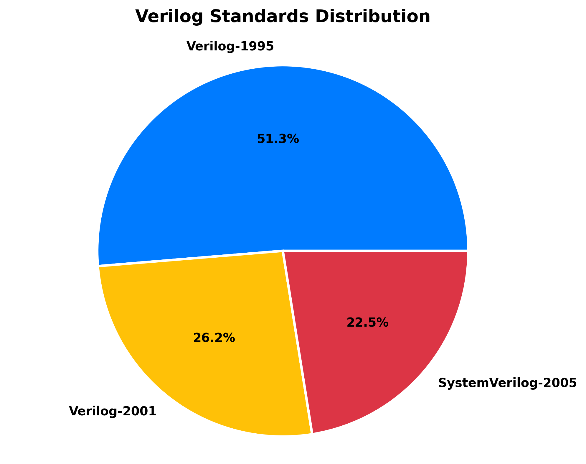
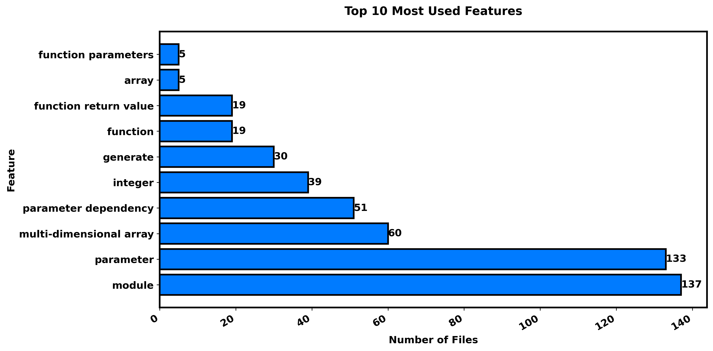

# Verilog Standards Analytics Report

Total Verilog files analyzed: **138**

Successfully parsed: **138**

Failed to parse: **0**

Directory analyzed: `libraries`

## Standards Summary

| Standard | File Count |
|----------|------------|
| Verilog-1995 | 138 |
| Verilog-2001 | 43 |
| Verilog-2005 | 0 |
| SystemVerilog-2005 | 135 |
| SystemVerilog-2009 | 1 |
| SystemVerilog-2012 | 2 |
| SystemVerilog-2017 | 2 |

---

## File-by-File Analysis

| File | Standard(s) | Features | Parse Time | Status |
|------|-------------|----------|------------|--------|
| `adders/configurable_brent_kung_adder.v` | SystemVerilog-2005, Verilog-1995, Verilog-2001 | generate, int, module, wire | 0.000s | ✅ OK |
| `adders/configurable_carry_lookahead_adder.v` | SystemVerilog-2005, Verilog-1995, Verilog-2001 | generate, int, module, wire | 0.000s | ✅ OK |
| `adders/configurable_carry_select_adder.v` | SystemVerilog-2005, Verilog-1995, Verilog-2001 | generate, int, module, wire | 0.000s | ✅ OK |
| `adders/configurable_carry_skip_adder.v` | SystemVerilog-2005, Verilog-1995, Verilog-2001 | generate, int, module, wire | 0.000s | ✅ OK |
| `adders/configurable_conditional_sum_adder.v` | SystemVerilog-2005, Verilog-1995, Verilog-2001 | array, generate, module, multi-dimensional array, parameter | 0.000s | ✅ OK |
| `adders/configurable_kogge_stone_adder.v` | SystemVerilog-2005, Verilog-1995, Verilog-2001 | generate, int, module, wire | 0.000s | ✅ OK |
| `alu/alu.v` | SystemVerilog-2005, Verilog-1995 | always, int, module, reg, wire | 0.000s | ✅ OK |
| `alu/configurable_comparator.v` | SystemVerilog-2005, Verilog-1995, Verilog-2001 | always, int, module, reg, signed, wire | 0.000s | ✅ OK |
| `arbiters/arbiter.v` | SystemVerilog-2005, Verilog-1995 | always, int, module, priority, reg, wire | 0.000s | ✅ OK |
| `arbiters/arbiter_rr.v` | SystemVerilog-2005, Verilog-1995 | always, int, module, priority, reg, wire | 0.000s | ✅ OK |
| `arbiters/fair_priority_arbiter.v` | SystemVerilog-2005, Verilog-1995, Verilog-2001 | function, function return value, generate, integer, module, multi-dimensional array, parameter | 0.000s | ✅ OK |
| `arbiters/matrix_arbiter.v` | Verilog-1995, Verilog-2001 | function, function return value, integer, module, parameter, parameter dependency | 0.000s | ✅ OK |
| `cdc/bsg_async_credit_counter.v` | SystemVerilog-2005, Verilog-1995, Verilog-2001 | generate, module, multi-dimensional array, parameter | 0.000s | ✅ OK |
| `cdc/clock_domain_crossing.v` | SystemVerilog-2005, Verilog-1995 | always, int, module, reg, wire | 0.000s | ✅ OK |
| `cdc/clock_domain_crossing_fifo.v` | SystemVerilog-2005, Verilog-1995, Verilog-2001 | function, function parameters, function return value, integer, module, multi-dimensional array, parameter, parameter dependency | 0.000s | ✅ OK |
| `cdc/handshake_synchronizer.v` | SystemVerilog-2005, Verilog-1995 | always, int, module, reg, wire | 0.000s | ✅ OK |
| `cdc/multi_flop_synchronizer.v` | SystemVerilog-2005, Verilog-1995, Verilog-2001 | always, generate, initial, int, module, reg, wire | 0.000s | ✅ OK |
| `codings/binary_to_gray.v` | SystemVerilog-2005, Verilog-1995, Verilog-2001 | generate, int, module, wire | 0.000s | ✅ OK |
| `codings/configurable_priority_encoder.v` | SystemVerilog-2005, Verilog-1995 | always, int, module, reg, wire | 0.000s | ✅ OK |
| `codings/gray_to_binary.v` | SystemVerilog-2005, Verilog-1995 | always, int, module, reg, wire | 0.000s | ✅ OK |
| `codings/hamming_code.v` | SystemVerilog-2005, Verilog-1995 | bit, int, module, wire | 0.000s | ✅ OK |
| `codings/parameterized_crc_generator.v` | SystemVerilog-2005, Verilog-1995 | always, int, module, reg, wire | 0.000s | ✅ OK |
| `codings/parameterized_scrambler.v` | SystemVerilog-2005, Verilog-1995, Verilog-2001 | always, generate, input, int, module, reg, wire | 0.000s | ✅ OK |
| `codings/priority_encoder.v` | SystemVerilog-2005, Verilog-1995 | always, int, module, reg, wire | 0.000s | ✅ OK |
| `comms/ahb_lite_master.v` | SystemVerilog-2005, Verilog-1995 | always, int, module, reg, wire | 0.000s | ✅ OK |
| `comms/basic_spi_master.v` | SystemVerilog-2005, Verilog-1995 | always, bit, int, module, reg, wire | 0.000s | ✅ OK |
| `comms/final_spi_master.v` | SystemVerilog-2005, Verilog-1995 | always, bit, int, module, reg, wire | 0.000s | ✅ OK |
| `comms/fixed_spi_master.v` | SystemVerilog-2005, Verilog-1995 | always, bit, int, module, reg, wire | 0.000s | ✅ OK |
| `comms/parameterized_deserializer.v` | SystemVerilog-2005, Verilog-1995 | always, bit, int, module, reg, wire | 0.000s | ✅ OK |
| `comms/parameterized_i2c_master.v` | SystemVerilog-2005, Verilog-1995 | always, bit, int, module, reg, wire | 0.000s | ✅ OK |
| `comms/parameterized_serdes.v` | SystemVerilog-2005, Verilog-1995 | always, bit, int, module, reg, wire | 0.000s | ✅ OK |
| `comms/parameterized_spi_master.v` | SystemVerilog-2005, Verilog-1995 | always, bit, int, module, reg, wire | 0.000s | ✅ OK |
| `comms/parameterized_uart_rx.v` | SystemVerilog-2005, Verilog-1995, Verilog-2001 | always, bit, byte, for, initial, int, module, reg, wire | 0.000s | ✅ OK |
| `comms/parameterized_uart_tx.v` | SystemVerilog-2005, SystemVerilog-2017, Verilog-1995, Verilog-2001 | always, bit, end, initial, int, let, module, reg, time, wire | 0.000s | ✅ OK |
| `comms/simple_spi_master.v` | SystemVerilog-2005, Verilog-1995 | always, bit, int, module, reg, wire | 0.000s | ✅ OK |
| `comms/spi_master.v` | SystemVerilog-2005, Verilog-1995 | always, bit, int, module, reg, wire | 0.000s | ✅ OK |
| `cordic/cordic.v` | SystemVerilog-2005, Verilog-1995 | always, initial, int, module, reg, wire | 0.000s | ✅ OK |
| `cordic/cordic_core.v` | SystemVerilog-2005, Verilog-1995 | always, int, module, reg, wire | 0.000s | ✅ OK |
| `cordic/sine_cosine_generator.v` | SystemVerilog-2005, Verilog-1995 | always, int, module, reg, wire | 0.000s | ✅ OK |
| `counters/configurable_clz_clo.v` | SystemVerilog-2005, Verilog-1995 | always, int, module, reg, wire | 0.000s | ✅ OK |
| `counters/gray_counter.v` | SystemVerilog-2005, Verilog-1995 | always, int, module, reg, wire | 0.000s | ✅ OK |
| `counters/johnson_counter.v` | SystemVerilog-2005, Verilog-1995 | always, int, module, reg, wire | 0.000s | ✅ OK |
| `counters/leading_zero_counter.v` | Verilog-1995, Verilog-2001 | function, function return value, integer, module, parameter, parameter dependency, preprocessor | 0.000s | ✅ OK |
| `counters/loadable_updown_counter.v` | SystemVerilog-2005, Verilog-1995 | always, int, module, reg, wire | 0.000s | ✅ OK |
| `counters/parameterized_decade_counter.v` | SystemVerilog-2005, Verilog-1995 | always, int, module, reg, wire | 0.000s | ✅ OK |
| `counters/parameterized_gray_counter.v` | SystemVerilog-2005, Verilog-1995 | always, int, module, reg, wire | 0.000s | ✅ OK |
| `counters/parameterized_johnson_counter.v` | SystemVerilog-2005, Verilog-1995 | always, int, module, reg, wire | 0.000s | ✅ OK |
| `counters/parameterized_johnson_updown_counter.v` | SystemVerilog-2005, Verilog-1995 | always, int, module, reg, wire | 0.000s | ✅ OK |
| `counters/parameterized_loadable_counter.v` | SystemVerilog-2005, Verilog-1995 | always, initial, int, module, reg, wire | 0.000s | ✅ OK |
| `counters/parameterized_onehot_counter.v` | SystemVerilog-2005, Verilog-1995 | always, int, module, reg, wire | 0.000s | ✅ OK |
| `counters/parameterized_ring_counter.v` | SystemVerilog-2005, Verilog-1995 | always, int, module, reg, wire | 0.000s | ✅ OK |
| `counters/parameterized_self_correcting_counter.v` | Verilog-1995, Verilog-2001 | automatic function, function, function return value, module, parameter, parameter dependency | 0.000s | ✅ OK |
| `counters/parameterized_sync_reset_counter.v` | SystemVerilog-2005, Verilog-1995 | always, int, module, reg, wire | 0.000s | ✅ OK |
| `counters/parameterized_updown_counter.v` | SystemVerilog-2005, Verilog-1995 | always, int, module, reg, wire | 0.000s | ✅ OK |
| `debug/logic_analyzer.v` | SystemVerilog-2005, Verilog-1995 | array, integer, module, multi-dimensional array, parameter | 0.000s | ✅ OK |
| `debug/performance_counter.v` | SystemVerilog-2005, Verilog-1995, Verilog-2001 | generate, integer, module, multi-dimensional array, parameter | 0.000s | ✅ OK |
| `encryption/aes_core.v` | SystemVerilog-2005, Verilog-1995, Verilog-2001 | always, byte, for, initial, int, module, reg, time, wire | 0.000s | ✅ OK |
| `encryption/true_random_generator.v` | SystemVerilog-2005, Verilog-1995, Verilog-2001 | always, generate, int, module, output, reg, wire | 0.000s | ✅ OK |
| `fifos/async_fifo.v` | SystemVerilog-2005, Verilog-1995 | function, function parameters, function return value, integer, module, multi-dimensional array, parameter | 0.000s | ✅ OK |
| `fifos/barrel_shifter_fifo.v` | SystemVerilog-2005, Verilog-1995 | always, int, module, reg, wire | 0.000s | ✅ OK |
| `fifos/bidirectional_fifo.v` | SystemVerilog-2005, Verilog-1995 | always, int, module, reg, wire | 0.000s | ✅ OK |
| `fifos/cache_fifo.v` | SystemVerilog-2005, Verilog-1995 | always, int, module, reg, wire | 0.000s | ✅ OK |
| `fifos/circular_buffer_fifo.v` | SystemVerilog-2005, Verilog-1995 | always, int, module, reg, wire | 0.000s | ✅ OK |
| `fifos/configurable_param_fifo.v` | SystemVerilog-2005, Verilog-1995, Verilog-2001 | always, generate, int, module, reg, wire | 0.000s | ✅ OK |
| `fifos/configurable_sync_fifo.v` | SystemVerilog-2005, Verilog-1995 | always, int, module, reg, wire | 0.000s | ✅ OK |
| `fifos/credit_based_fifo.v` | SystemVerilog-2005, Verilog-1995 | always, int, module, reg, wire | 0.000s | ✅ OK |
| `fifos/dual_clock_fifo.v` | SystemVerilog-2005, Verilog-1995 | function, function parameters, function return value, integer, module, multi-dimensional array, parameter | 0.000s | ✅ OK |
| `fifos/elastic_buffer.v` | SystemVerilog-2005, Verilog-1995 | function, function parameters, function return value, integer, module, multi-dimensional array, parameter | 0.000s | ✅ OK |
| `fifos/fifo.v` | SystemVerilog-2005, Verilog-1995 | always, int, module, reg, wire | 0.000s | ✅ OK |
| `fifos/fwft_fifo.v` | SystemVerilog-2005, Verilog-1995 | always, int, module, output, reg, wire | 0.000s | ✅ OK |
| `fifos/memory_mapped_fifo.v` | SystemVerilog-2005, Verilog-1995 | always, int, module, reg, wire | 0.000s | ✅ OK |
| `fifos/multi_ported_fifo.v` | SystemVerilog-2005, Verilog-1995, Verilog-2001 | function, function parameters, function return value, generate, integer, module, multi-dimensional array, parameter, parameter dependency | 0.000s | ✅ OK |
| `fifos/parameterized_priority_queue.v` | SystemVerilog-2005, SystemVerilog-2012, Verilog-1995 | always, int, module, priority, queue, reg, wire | 0.000s | ✅ OK |
| `fifos/pipelined_fifo.v` | SystemVerilog-2005, Verilog-1995 | always, int, module, reg, wire | 0.000s | ✅ OK |
| `fifos/showahead_fifo.v` | SystemVerilog-2005, Verilog-1995 | always, int, module, reg, wire | 0.000s | ✅ OK |
| `fifos/skid_buffer.v` | SystemVerilog-2005, Verilog-1995 | always, int, module, reg, wire | 0.000s | ✅ OK |
| `fifos/smart_fifo.v` | SystemVerilog-2005, Verilog-1995 | always, int, module, reg, wire | 0.000s | ✅ OK |
| `fifos/sync_fifo.v` | SystemVerilog-2005, Verilog-1995 | always, int, module, reg, wire | 0.000s | ✅ OK |
| `filters/configurable_fir_filter.v` | SystemVerilog-2005, Verilog-1995, Verilog-2001 | function, function return value, integer, module, multi-dimensional array, parameter, parameter dependency | 0.000s | ✅ OK |
| `filters/fir_filter.v` | SystemVerilog-2005, Verilog-1995 | always, initial, int, module, reg, wire | 0.000s | ✅ OK |
| `fsm/sequence_detector_fsm.v` | SystemVerilog-2005, Verilog-1995 | always, input, int, module, reg, wire | 0.000s | ✅ OK |
| `interfaces/axi_lite_master.v` | SystemVerilog-2005, Verilog-1995 | always, int, module, reg, wire | 0.000s | ✅ OK |
| `interfaces/axi_stream_interface.v` | SystemVerilog-2005, Verilog-1995 | int, module, wire | 0.000s | ✅ OK |
| `interfaces/pcie_endpoint.v` | SystemVerilog-2005, SystemVerilog-2009, Verilog-1995, Verilog-2001 | always, class, end, initial, int, module, reg, time, wire | 0.000s | ✅ OK |
| `interfaces/wishbone_master.v` | SystemVerilog-2005, Verilog-1995 | always, int, module, reg, wire | 0.000s | ✅ OK |
| `io/dma_controller.v` | SystemVerilog-2005, Verilog-1995 | function, function return value, integer, module, multi-dimensional array, parameter | 0.000s | ✅ OK |
| `io/gpio_controller.v` | SystemVerilog-2005, Verilog-1995, Verilog-2001 | always, generate, int, module, reg, wire | 0.000s | ✅ OK |
| `math/fixed_point_sqrt.v` | SystemVerilog-2005, Verilog-1995 | always, int, module, reg, wire | 0.000s | ✅ OK |
| `math/floating_point_adder.v` | SystemVerilog-2005, Verilog-1995, Verilog-2001 | always, bit, end, int, module, reg, wire | 0.000s | ✅ OK |
| `math/non_restoring_divider.v` | SystemVerilog-2005, Verilog-1995, Verilog-2001 | always, end, int, module, reg, wire | 0.000s | ✅ OK |
| `mems/ddr_controller.v` | SystemVerilog-2005, Verilog-1995, Verilog-2001 | always, generate, int, module, reg, time, wire | 0.000s | ✅ OK |
| `mems/dual_port_ram.v` | SystemVerilog-2005, Verilog-1995 | always, int, module, reg, wire | 0.000s | ✅ OK |
| `mems/memory_controller.v` | SystemVerilog-2005, Verilog-1995 | always, int, module, reg, wire | 0.000s | ✅ OK |
| `mems/parameterized_cam.v` | SystemVerilog-2005, Verilog-1995 | always, bit, int, module, reg, wire | 0.000s | ✅ OK |
| `multipliers/booth_multiplier.v` | SystemVerilog-2005, Verilog-1995, Verilog-2001 | always, int, module, reg, signed, wire | 0.000s | ✅ OK |
| `multipliers/configurable_mult.v` | SystemVerilog-2005, Verilog-1995, Verilog-2001 | always, int, module, reg, signed, wire | 0.000s | ✅ OK |
| `multipliers/radix4_booth_multiplier.v` | SystemVerilog-2005, Verilog-1995 | always, int, module, reg, wire | 0.000s | ✅ OK |
| `noc/configurable_mesh_router.v` | SystemVerilog-2005, Verilog-1995, Verilog-2001 | always, generate, input, int, module, output, reg, wire | 0.000s | ✅ OK |
| `noc/crossbar_switch.v` | SystemVerilog-2005, Verilog-1995 | always, int, module, reg, wire | 0.000s | ✅ OK |
| `noc/mesh_router.v` | SystemVerilog-2005, Verilog-1995, Verilog-2001 | function, function return value, generate, integer, module, multi-dimensional array, parameter | 0.000s | ✅ OK |
| `noc/network_interface.v` | SystemVerilog-2005, Verilog-1995 | always, int, module, reg, wire | 0.000s | ✅ OK |
| `noc/network_interface_cdc.v` | SystemVerilog-2005, Verilog-1995 | always, int, module, reg, wire | 0.000s | ✅ OK |
| `power/clock_divider.v` | SystemVerilog-2005, Verilog-1995 | always, int, module, reg, wire | 0.000s | ✅ OK |
| `power/clock_gating.v` | SystemVerilog-2005, Verilog-1995, Verilog-2001 | always, generate, int, module, reg, wire | 0.000s | ✅ OK |
| `power/parameterized_clock_gating.v` | SystemVerilog-2005, Verilog-1995, Verilog-2001 | always, generate, int, module, reg, wire | 0.000s | ✅ OK |
| `power/parameterized_freq_divider.v` | SystemVerilog-2005, Verilog-1995 | always, int, module, reg, time, wire | 0.000s | ✅ OK |
| `power/power_domain_controller.v` | SystemVerilog-2005, Verilog-1995 | always, int, module, reg, wire | 0.000s | ✅ OK |
| `registers/barrel_rotator.v` | SystemVerilog-2005, Verilog-1995 | always, int, module, reg, wire | 0.000s | ✅ OK |
| `registers/barrel_shifter.v` | SystemVerilog-2005, Verilog-1995 | always, int, module, reg, wire | 0.000s | ✅ OK |
| `registers/bidirectional_shift_register.v` | SystemVerilog-2005, Verilog-1995 | always, int, module, reg, wire | 0.000s | ✅ OK |
| `registers/dual_edge_register.v` | SystemVerilog-2005, Verilog-1995 | always, int, module, reg, wire | 0.000s | ✅ OK |
| `registers/lfsr.v` | SystemVerilog-2005, Verilog-1995, Verilog-2001 | always, bit, generate, int, module, reg, wire | 0.000s | ✅ OK |
| `registers/onehot_decoder_register.v` | SystemVerilog-2005, Verilog-1995 | always, initial, int, module, reg, wire | 0.000s | ✅ OK |
| `registers/parameterized_barrel_rotator.v` | SystemVerilog-2005, Verilog-1995, Verilog-2001 | always, end, int, module, reg, wire | 0.000s | ✅ OK |
| `registers/parameterized_rotation_sipo.v` | SystemVerilog-2005, Verilog-1995 | always, int, module, reg, wire | 0.000s | ✅ OK |
| `registers/piso_register.v` | SystemVerilog-2005, Verilog-1995 | always, int, module, reg, wire | 0.000s | ✅ OK |
| `registers/register_file.v` | SystemVerilog-2005, Verilog-1995 | always, int, module, reg, wire | 0.000s | ✅ OK |
| `registers/scan_register.v` | SystemVerilog-2005, Verilog-1995 | always, int, module, reg, wire | 0.000s | ✅ OK |
| `registers/shadow_register.v` | SystemVerilog-2005, Verilog-1995 | always, int, module, reg, wire | 0.000s | ✅ OK |
| `registers/shift_register_left.v` | SystemVerilog-2005, Verilog-1995 | always, int, module, reg, wire | 0.000s | ✅ OK |
| `registers/shift_register_right.v` | SystemVerilog-2005, Verilog-1995 | always, int, module, reg, wire | 0.000s | ✅ OK |
| `registers/sipo_register.v` | SystemVerilog-2005, Verilog-1995 | always, bit, int, module, reg, wire | 0.000s | ✅ OK |
| `registers/siso_register.v` | SystemVerilog-2005, Verilog-1995, Verilog-2001 | always, generate, int, module, reg, wire | 0.000s | ✅ OK |
| `registers/sync_preset_register.v` | SystemVerilog-2005, Verilog-1995 | always, int, module, reg, wire | 0.000s | ✅ OK |
| `registers/toggle_register.v` | SystemVerilog-2005, Verilog-1995 | always, int, module, reg, wire | 0.000s | ✅ OK |
| `registers/universal_shift_register.v` | SystemVerilog-2005, Verilog-1995 | always, int, module, reg, wire | 0.000s | ✅ OK |
| `signals/configurable_lfsr.v` | SystemVerilog-2005, Verilog-1995, Verilog-2001 | always, bit, generate, int, module, reg, wire | 0.000s | ✅ OK |
| `signals/configurable_prng.v` | SystemVerilog-2005, Verilog-1995 | always, int, module, reg, wire | 0.000s | ✅ OK |
| `signals/digital_thermometer_controller.v` | SystemVerilog-2005, Verilog-1995, Verilog-2001 | always, for, initial, input, int, module, reg, wire | 0.000s | ✅ OK |
| `signals/multi_phase_pwm_controller.v` | SystemVerilog-2005, Verilog-1995, Verilog-2001 | always, end, generate, int, module, reg, time, wire | 0.000s | ✅ OK |
| `signals/parameterized_dds.v` | SystemVerilog-2005, SystemVerilog-2012, Verilog-1995, Verilog-2001 | always, generate, initial, int, module, reg, wire, with | 0.000s | ✅ OK |
| `signals/parameterized_fft.v` | SystemVerilog-2005, Verilog-1995, Verilog-2001 | function, function return value, integer, module, multi-dimensional array, parameter, parameter dependency | 0.000s | ✅ OK |
| `signals/parameterized_pwm.v` | SystemVerilog-2005, Verilog-1995 | always, int, module, reg, wire | 0.000s | ✅ OK |
| `signals/pulse_width_detector.v` | SystemVerilog-2005, Verilog-1995 | always, int, module, reg, wire | 0.000s | ✅ OK |
| `signals/pwm_generator.v` | SystemVerilog-2005, Verilog-1995 | always, int, module, reg, wire | 0.000s | ✅ OK |
| `test/bist_controller.v` | SystemVerilog-2005, SystemVerilog-2017, Verilog-1995 | always, int, let, module, reg, wire | 0.000s | ✅ OK |
| `test/jtag_controller.v` | SystemVerilog-2005, Verilog-1995 | always, int, module, reg, struct, wire | 0.000s | ✅ OK |
| `voters/majority_voter.v` | SystemVerilog-2005, Verilog-1995 | always, input, int, module, reg, wire | 0.000s | ✅ OK |

## Visualizations

The following charts provide a visual representation of the standards and features usage:

<h3>Standards Usage (Bar Chart)</h3>

<h3>Standards Distribution (Pie Chart)</h3>

<h3>Top 10 Most Used Features</h3>

